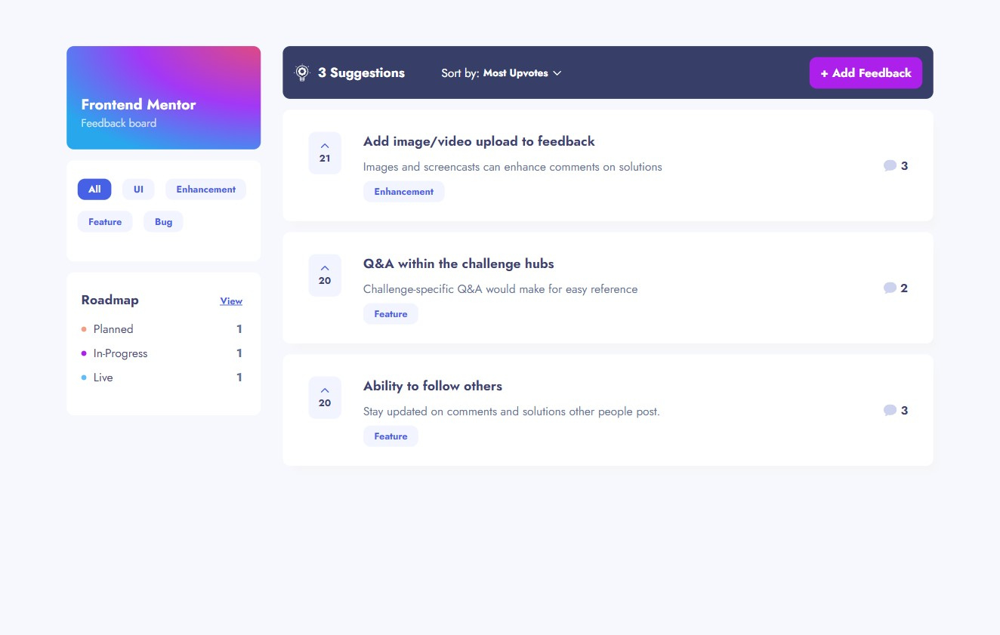
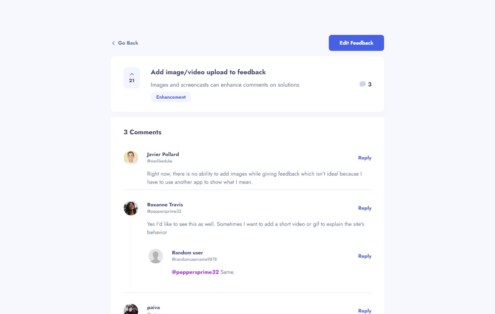
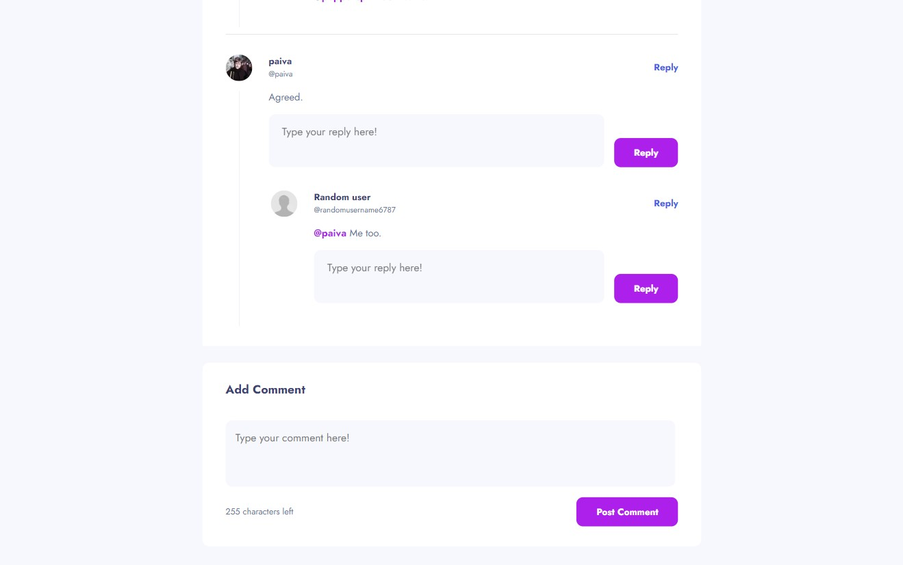
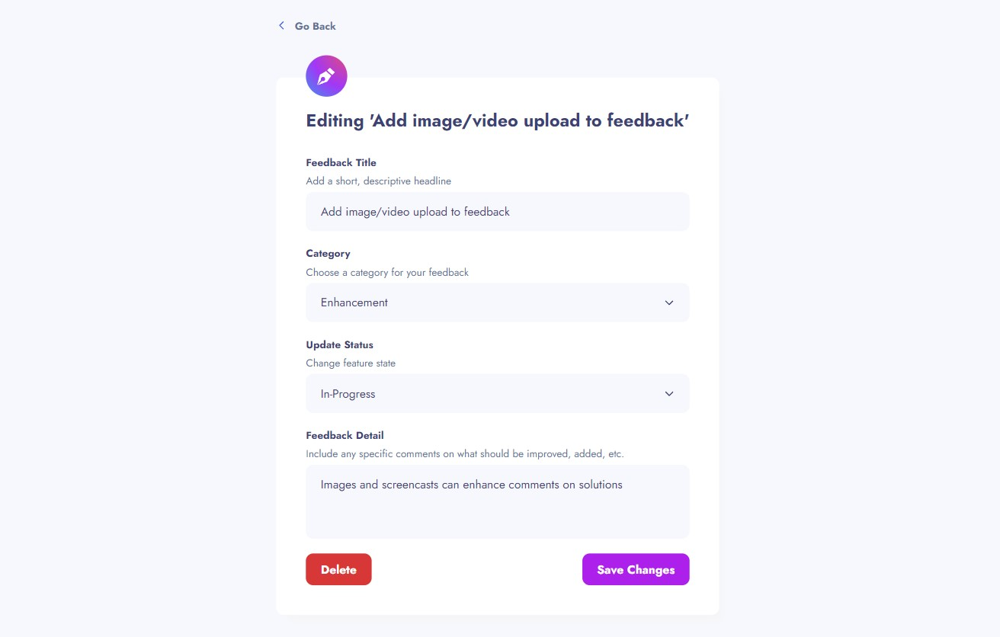
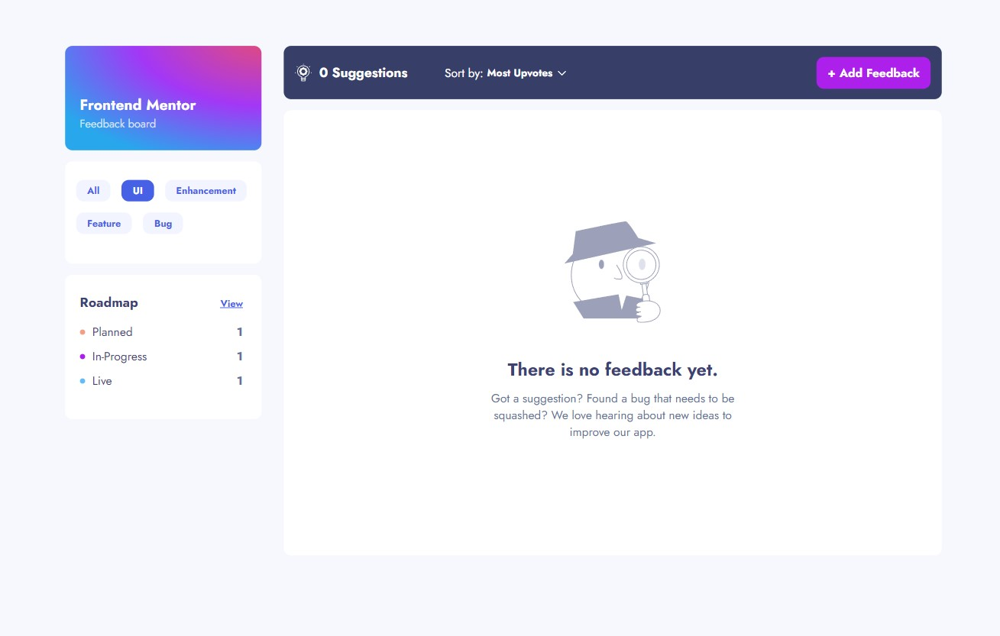
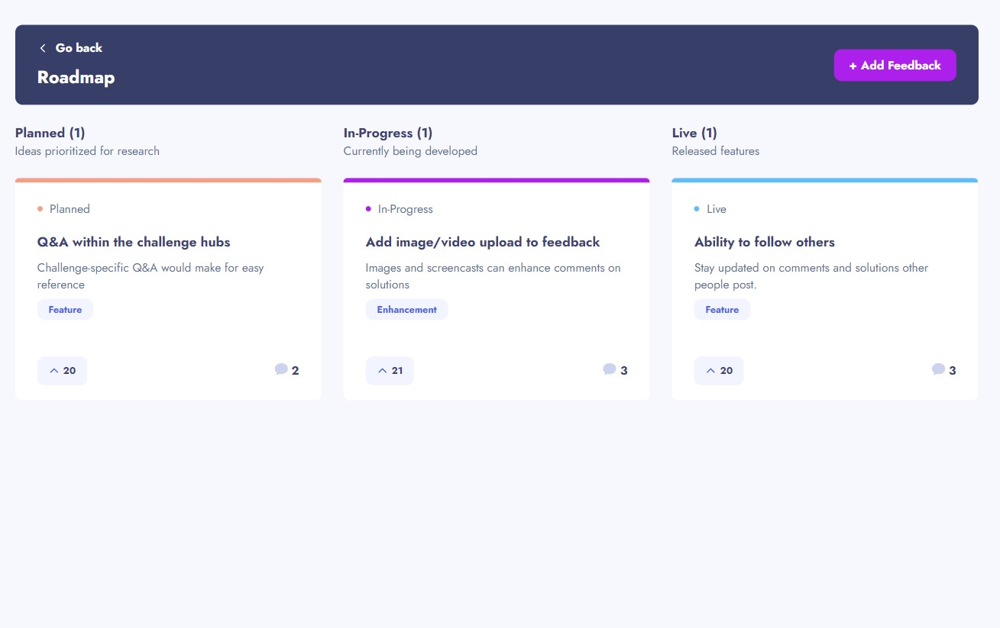
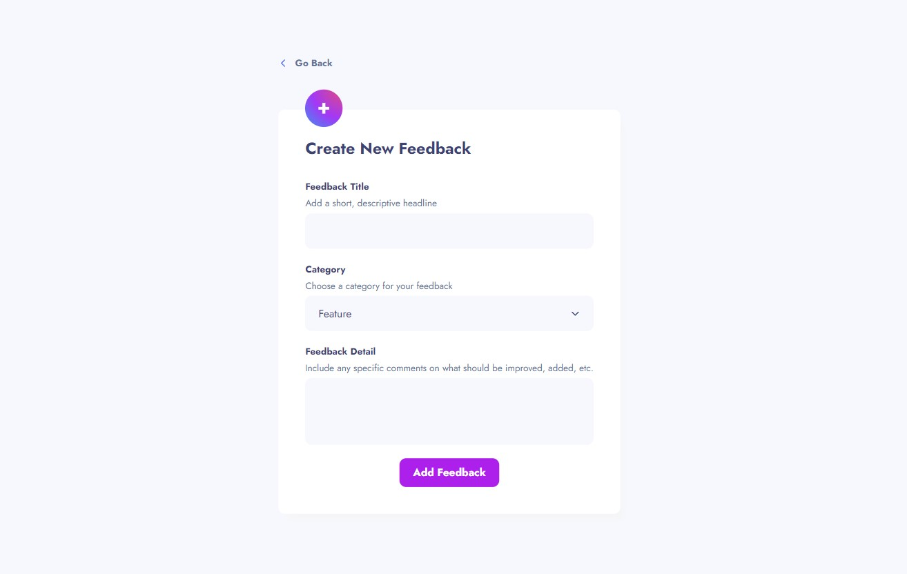

# Frontend Mentor - Product feedback app

This is a completion of the [Frontend Mentors](https://frontendmentors.io) "Product Feedback" challenge.

Frontend (Netlify): [Vercel]()

## [Demo Video]: (https://www.loom.com/share/b9dd762f76c84efd98bc1bab7713a8ce?sid=4cd042f2-f2ed-43ed-9f3d-93397a7f2330)

[Frontend Mentor](https://www.frontendmentor.io) challenges help you improve your coding skills by building realistic projects. These premium challenges are perfect portfolio pieces, so please feel free to use what you create in your portfolio to show others.

**To do this challenge, you need a strong understanding of HTML, CSS, and JavaScript.**

## Technologies Used

- TypeScript
- React (Next);
- Stitches (CSS);
- Prisma (MySQL)
- Docker

<br />
<br />

## Contributors

João Vitor Paiva (GitHub: [@Paiva2](https://github.com/Paiva2))

## Installation

```bash
$ npm install
```

## Running the app

```bash
$ npm run start
```

## The challenge

Your challenge is to build out this product feedback application and get it looking as close to the design as possible.

You can use any tools you like to help you complete the challenge. So if you've got something you'd like to practice, feel free to give it a go.

We provide the data in a local `data.json` file, so use that to populate the content on the first load. If you want to take it up a notch, feel free to build this as a full-stack application!

Your users should be able to:

- View the optimal layout for the app depending on their device's screen size
- See hover states for all interactive elements on the page
- Create, read, update, and delete product feedback requests
- Receive form validations when trying to create/edit feedback requests
- Sort suggestions by most/least upvotes and most/least comments
- Filter suggestions by category
- Add comments and replies to a product feedback request
- Upvote product feedback requests
- **Bonus**: Keep track of any changes, even after refreshing the browser (`localStorage` could be used for this if you're not building out a full-stack app)

## Images








